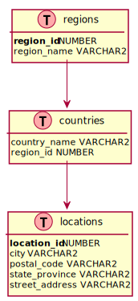

# ora2uml

Generate [PlantUML](https://plantuml.com) dot files from Oracle data dictionary. Idea and PlantUML template from [QuantumGhost's exampl.puml Gits](https://gist.github.com/QuantumGhost/0955a45383a0b6c0bc24f9654b3cb561).

Sample image:



To generate a png:

```bash
plantuml sample.puml
```

To generate a svg:

```bash
plantuml -tsvg sample.puml
```
